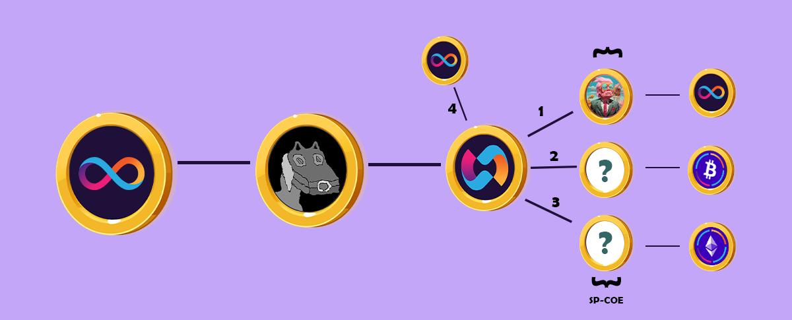

# NFT sp-coe collection details

**There are a total of 1000 NFTs that fall into the sp-coe category. sp-coe NFTs are aimed at financing large advertisements. Each NFT of the sp-coe group has a value equal to 210 COE tokens.**

### Advertising with the help of sp-coe

Investors are definitely not satisfied if we receive ICP tokens from them and cash the tokens in the open market to pay advertising dollars!

So we planned a new style of advertising! In this style of advertising, neither the capital is removed from the chain, nor the investors suffer, in fact, all the attracted capital returns to sp-coe investors in a different and decentralized manner.

Even this plan can be profitable for investors before the distribution of COE tokens.\
sp-coe is not a collection of NFTs, but a parent category that contains three different NFT collections.

**Each NFT collection of this category becomes a 100% independent community-oriented project to independently form its own community and also contribute to the interests of the COE.**

<figure><figcaption>
<strong>sp-coe</strong>
</figcaption></figure>

#### Completion of three sp-coe steps

Completing the three stages of sp-coe in the roadmap is done in the form of three independent projects with different supports. The set of NFTs sold in this section is 1000 pieces. This 1000 NFT will be sold in three phases. The sp-coe section started with the ALP project, a science fiction story that targets human beliefs and announces the birth of artificial intelligence.

**This action can strengthen the roots of COE token liquidity before the full distribution of COE tokens.**

### ALP project

ALP is the first project that is placed in the sp-coe category. ALP is the beginning of a science fiction story. ALP consists of a total of 290 NFTs, and the price of these NFTs will be determined at the first COE project DAO meeting.

We suggest that after checking the COE completely, you should visit the ALP project and examine the ALP project independently.

* ALP : [https://alp-icp.gitbook.io/a-liberal-president/science-fiction-story/a-liberal-president-alp](https://alp-icp.gitbook.io/a-liberal-president/science-fiction-story/a-liberal-president-alp)

<mark style="color:red;">**Note: New data will be added to the white paper as the roadmap progresses.**</mark>


[tokenomics](../tokenomics/)

